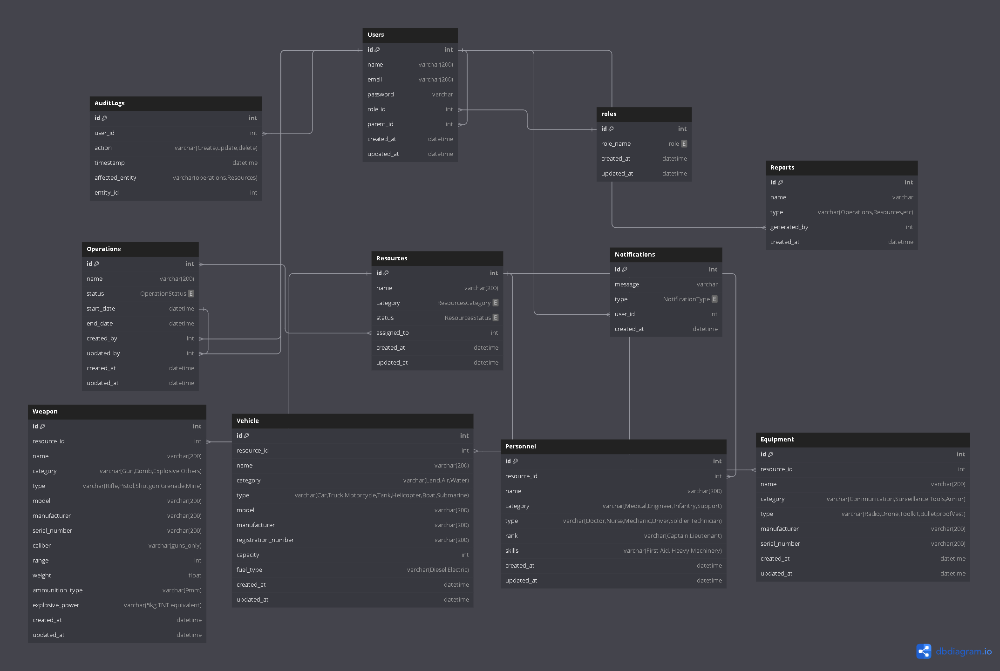

#  Strategic Defense Operations Management System

[](https://www.gnu.org/licenses/gpl-3.0)
[](https://laravel.com/)
[](https://nextjs.org/)
[](https://php.net/)
[](https://mysql.com/)

A comprehensive, enterprise-grade defense operations management platform designed to streamline military resource coordination, optimize operational efficiency, and enhance strategic decision-making through real-time data analytics and secure role-based access control.

## 📋 Table of Contents

- [🎯 Overview](#-overview)
- [✨ Key Features](#-key-features)
- [�️ System Architecture](#️-system-architecture)
- [� Tech Stack](#-tech-stack)
- [⚡ Quick Start](#-quick-start)
- [� Docker Deployment](#-docker-deployment)
- [�️ Database Schema](#️-database-schema)
- [� Authentication & Authorization](#-authentication--authorization)
- [� API Documentation](#-api-documentation)
- [🧪 Testing](#-testing)
- [� Monitoring & Logging](#-monitoring--logging)
- [� Team](#-team)
- [🤝 Contributing](#-contributing)
- [📄 License](#-license)

## 🎯 Overview

The Strategic Defense Operations Management System is a mission-critical application engineered to revolutionize defense operations coordination. This full-stack solution provides military command centers with unprecedented visibility into resource allocation, operational planning, and real-time mission monitoring capabilities.

### 🎯 Objectives

- **Centralized Command & Control**: Unified platform for managing all defense operations from a single interface
- **Resource Optimization**: Intelligent allocation and tracking of weapons, vehicles, personnel, and equipment
- **Real-time Decision Making**: Live operational data and analytics for informed strategic decisions
- **Security & Compliance**: Enterprise-grade security with role-based access control and comprehensive audit trails
- **Operational Excellence**: Streamlined workflows to enhance mission success rates and reduce operational overhead

### 🎯 Target Audience

- **Military Command Centers**: Strategic planning and operational oversight
- **Defense Operations Teams**: Tactical resource management and mission execution
- **Resource Management Units**: Inventory control and logistics coordination
- **Security Personnel**: Access control and audit trail monitoring

## ✨ Key Features

### 🔐 Advanced Authentication & Authorization

- **Multi-tier Role System**: Admin, Manager, Operator, and Viewer roles with granular permissions
- **OAuth Integration**: Google SSO support for streamlined authentication
- **Hierarchical Access Control**: Parent-child user relationships for command structure
- **JWT Token Management**: Secure API authentication with Laravel Sanctum

### 📊 Comprehensive Operations Dashboard

- **Real-time Operations Monitoring**: Live status tracking for ongoing, upcoming, and completed missions
- **Resource Allocation Overview**: Visual representation of resource distribution and availability
- **Mission Planning Tools**: Integrated planning interface with resource assignment capabilities
- **Status Management**: Dynamic operation status updates with automated notifications

### 🛠️ Advanced Resource Management

- **Multi-category Asset Tracking**: Weapons, vehicles, personnel, and equipment management
- **Serial Number Tracking**: Unique identification and traceability for all assets
- **Availability Monitoring**: Real-time status updates and maintenance scheduling
- **Batch Operations**: Efficient bulk resource allocation and management

### 📈 Intelligence & Analytics

- **Post-operation Reporting**: Automated report generation with AI-powered insights
- **Performance Analytics**: Comprehensive metrics and KPI tracking
- **Data Visualization**: Interactive charts and graphs for operational insights
- **Export Capabilities**: PDF and CSV export functionality for external reporting

### 🔔 Real-time Notifications

- **Multi-channel Alerts**: In-app notifications and email alerts
- **Event-driven Triggers**: Automated notifications for critical events
- **Role-based Filtering**: Customized notification preferences per user role
- **Escalation Management**: Automated escalation for critical issues

### 🗃️ Comprehensive Audit System

- **Complete Activity Logging**: Every user action tracked and stored
- **Compliance Reporting**: Detailed audit trails for regulatory compliance
- **Security Monitoring**: Access logs and unauthorized activity detection
- **Data Integrity**: Immutable audit records with timestamp verification

## 🏗️ System Architecture

```
┌─────────────────────────────────────────────────────────────┐
│                    Frontend (Next.js)                      │
│  ┌─────────────────┐ ┌─────────────────┐ ┌──────────────┐ │
│  │   Dashboard     │ │  Operations     │ │   Reports    │ │
│  └─────────────────┘ └─────────────────┘ └──────────────┘ │
└─────────────────────────────────────────────────────────────┘
                              │
                              ▼
┌─────────────────────────────────────────────────────────────┐
│                 API Gateway (Laravel)                      │
│  ┌─────────────────┐ ┌─────────────────┐ ┌──────────────┐ │
│  │ Authentication  │ │   Controllers   │ │  Middleware  │ │
│  └─────────────────┘ └─────────────────┘ └──────────────┘ │
└─────────────────────────────────────────────────────────────┘
                              │
                              ▼
┌─────────────────────────────────────────────────────────────┐
│                Service Layer (Business Logic)              │
│  ┌─────────────────┐ ┌─────────────────┐ ┌──────────────┐ │
│  │ Operation Mgmt  │ │ Resource Mgmt   │ │ Report Gen   │ │
│  └─────────────────┘ └─────────────────┘ └──────────────┘ │
└─────────────────────────────────────────────────────────────┘
                              │
                              ▼
┌─────────────────────────────────────────────────────────────┐
│                   Data Layer (MySQL)                       │
│  ┌─────────────────┐ ┌─────────────────┐ ┌──────────────┐ │
│  │   Operations    │ │    Resources    │ │ Audit Logs   │ │
│  └─────────────────┘ └─────────────────┘ └──────────────┘ │
└─────────────────────────────────────────────────────────────┘
```

## � Tech Stack

### Backend Infrastructure

- **Framework**: Laravel 9.x (PHP 8.2+)
- **Database**: MySQL 8.0+ with optimized indexing
- **Authentication**: Laravel Sanctum + OAuth (Google)
- **API Architecture**: RESTful APIs with comprehensive error handling
- **Activity Logging**: Spatie Laravel Activity Log for audit trails
- **Email Services**: Laravel Mail with queue support
- **File Storage**: Laravel Filesystem with S3 compatibility

### Frontend Technologies

- **Framework**: Next.js 14.x with App Router
- **UI Library**: React 18.x with TypeScript support
- **Styling**: Tailwind CSS + Bootstrap 5.x
- **Component Library**: Chakra UI + Radix UI primitives
- **State Management**: SWR for server state management
- **Animations**: Framer Motion for smooth transitions
- **Icons**: Lucide React + Heroicons

### Development & Deployment

- **Containerization**: Docker with multi-stage builds
- **Web Server**: Apache with mod_rewrite
- **Process Management**: PHP-FPM for optimal performance
- **Testing**: PHPUnit for backend, Jest for frontend
- **Code Quality**: ESLint, Prettier, Laravel Pint
- **Version Control**: Git with conventional commits

### Security & Monitoring

- **CORS**: Configured for secure cross-origin requests
- **Rate Limiting**: API throttling and abuse prevention
- **Input Validation**: Comprehensive validation rules
- **SQL Injection Protection**: Eloquent ORM with prepared statements
- **XSS Protection**: Laravel's built-in security features

## ⚡ Quick Start

### Prerequisites

- **PHP**: 8.2 or higher
- **Composer**: Latest version
- **Node.js**: 18.x or higher
- **npm/yarn**: Latest version
- **MySQL**: 8.0 or higher
- **Git**: For version control

### Backend Setup

1. **Clone the repository**

   ```bash
   git clone https://github.com/mashrur-rahman-fahim/StrategicDefenseOps.git
   cd StrategicDefenseOps/backend
   ```

2. **Install PHP dependencies**

   ```bash
   composer install
   ```

3. **Environment configuration**

   ```bash
   cp .env.example .env
   php artisan key:generate
   ```

4. **Configure your `.env` file**

   ```env
   APP_NAME="Strategic Defense Operations"
   APP_ENV=local
   APP_KEY=base64:your_generated_key_here
   APP_DEBUG=true
   APP_URL=http://localhost:8000
   FRONTEND_URL=http://localhost:3000

   DB_CONNECTION=mysql
   DB_HOST=127.0.0.1
   DB_PORT=3306
   DB_DATABASE=strategic_defense
   DB_USERNAME=your_username
   DB_PASSWORD=your_password

   # Google OAuth (Optional)
   GOOGLE_CLIENT_ID=your_google_client_id
   GOOGLE_CLIENT_SECRET=your_google_client_secret
   GOOGLE_REDIRECT_URI="${APP_URL}/auth/google/callback"
   ```

5. **Database setup**

   ```bash
   # Create database
   mysql -u root -p -e "CREATE DATABASE strategic_defense;"

   # Run migrations
   mysql -u your_username -p strategic_defense < database/migrations/001_init_tables.sql
   ```

6. **Start the development server**
   ```bash
   php artisan serve
   ```

### Frontend Setup

1. **Navigate to frontend directory**

   ```bash
   cd ../frontend
   ```

2. **Install dependencies**

   ```bash
   npm install
   # or
   yarn install
   ```

3. **Environment configuration**

   ```bash
   cp .env.example .env.local
   ```

4. **Configure your `.env.local` file**

   ```env
   NEXT_PUBLIC_BACKEND_URL=http://localhost:8000
   NEXT_PUBLIC_FRONTEND_URL=http://localhost:3000
   ```

5. **Start the development server**

   ```bash
   npm run dev
   # or
   yarn dev
   ```

6. **Access the application**
   - Frontend: http://localhost:3000
   - Backend API: http://localhost:8000/api

### Default Credentials

- **Email**: admin@example.com
- **Password**: password123 (change immediately in production)

---

## 🎨 UI Design

[**🔗 View the ERD on Figma**](https://www.figma.com/design/Yj0yCxlnNI0jvJWOdml3Of/StrategicDefenseOps?node-id=0-1&p=f&t=CqUVnzrobXx0kBXt-0)

---

## 🎨 ERD (Entity Relationship Diagram)



## ⚙️ Features

### 🔒 User Authentication & Role Management

- **Roles and Access**:
  - **Admin**: Full access to all authentication settings and role management.
  - **Manager**: Can manage users within their operations but cannot assign roles.
  - **Operator**: No access to role management or authentication settings.
  - **Viewer**: No access to role management or authentication settings.
- **How It Works**:
  - Users can register, log in, and authenticate through a secure system.
  - Roles (Admin, Manager, Operator, Viewer) are assigned upon user registration or by an Admin.
  - Each user’s access is restricted based on their role, ensuring that only authorized users can access sensitive data or features.
  - Admins can modify user roles and permissions to control access across the system.

---

### 📊 Operations Dashboard

- **Roles and Access**:
  - **Admin**: Full access to view, update, create, and delete operations.
  - **Manager**: Can view, update, and create operations but cannot delete.
  - **Operator**: Can view assigned operations and update their status.
  - **Viewer**: Read-only access to view ongoing and upcoming operations.
- **How It Works**:
  - Displays all ongoing and upcoming defense operations.
  - Admins and Managers can create and modify operations, specifying important details like start/end dates, resources, and personnel involved.
  - Operators can mark operations as completed or update their status.
  - Operations are grouped by status (Ongoing, Upcoming, Completed) to ensure easy monitoring.
  - A real-time updating system ensures that the dashboard is always current with the latest operation statuses.
  - **Weather Updates**: Weather information (e.g., temperature, humidity, storm warnings) will be displayed on the operations dashboard, integrating real-time weather data relevant to the operation locations.
  - **Location Tracking**: The system will track the real-time location of personnel, resources, and vehicles, which will be displayed directly on the operations dashboard to provide a comprehensive view.

---

### 🛠️ Resource Management

- **Roles and Access**:
  - **Admin**: Full access to manage resources (add, update, allocate, and delete).
  - **Manager**: Can allocate and update resources but cannot add or delete.
  - **Operator**: Can view assigned resources and update their status.
  - **Viewer**: Read-only access to view resource details.
- **How It Works**:
  - Admins and Managers can track and allocate resources such as vehicles, personnel, and equipment.
  - Resources are categorized (e.g., available, in use, maintenance) for easy monitoring.
  - Real-time alerts notify users of resource status changes (e.g., maintenance required).
  - Operators can only interact with resources assigned to their specific operations, ensuring that resources are not overused or misallocated.
  - Resources can be assigned directly to operations based on real-time needs and availability.

---

### 📈 Reports & Analytics

- **Roles and Access**:
  - **Admin**: Full access to view, generate, and export reports.
  - **Manager**: Can generate and view reports within their scope of operations.
  - **Operator**: Cannot generate or view reports.
  - **Viewer**: Cannot generate or view reports.
- **How It Works**:
  - Reports can be generated based on operations, resources, and other criteria like date range or resource type.
  - Admins and Managers can view generated reports and export them in formats like CSV or PDF.
  - Analytics include graphical visualizations such as pie charts, bar graphs, and line charts to help users interpret data and performance trends.
  - Reports are automatically generated after certain operations or resource changes, providing real-time insights into operations efficiency and resource utilization.

---

### 🔔 Notifications

- **Roles and Access**:
  - **Admin**: Can configure and send notifications to all users.
  - **Manager**: Can send notifications to users within their scope of operations.
  - **Operator**: Can receive notifications related to assigned operations and resources.
  - **Viewer**: Can receive notifications but cannot send or configure them.
- **How It Works**:
  - Real-time notifications alert users about critical events (e.g., operation status changes, resource issues).
  - Admins and Managers can configure notification triggers for specific actions (e.g., resource allocation, operation completion).
  - Notifications are sent via email or in-app alerts, and users can customize their preferences for which notifications they receive.
  - Operators receive updates relevant to their assigned operations, while Admins can configure system-wide alerts.
  - **Email Notifications**: Admins can configure automated email alerts for important events or updates regarding operations, resources, or system changes.

---

### 🗒️ Audit Logs

- **Roles and Access**:
  - **Admin**: Full access to all audit logs, including search and filter functionalities.
  - **Manager**: Can view audit logs related to operations and resources they manage.
  - **Operator**: Cannot access audit logs.
  - **Viewer**: Cannot access audit logs.
- **How It Works**:
  - Every action performed by a user (e.g., login, resource allocation, report generation) is logged in the system.
  - Admins have access to a complete audit trail of all actions performed within the system, which can be filtered by user, action type, or time range.
  - Logs include essential information such as timestamp, user details, action performed, and the affected resources or operations.
  - Audit logs ensure transparency, providing a detailed record of every system interaction for compliance, troubleshooting, and security purposes.

---

## � Docker Deployment

### Using Docker Compose (Recommended)

1. **Create docker-compose.yml**

   ```yaml
   version: "3.8"
   services:
     app:
       build:
         context: ./backend
         dockerfile: Dockerfile
       ports:
         - "8000:80"
       environment:
         - DB_HOST=db
         - DB_DATABASE=strategic_defense
         - DB_USERNAME=root
         - DB_PASSWORD=secret
       depends_on:
         - db
       volumes:
         - ./backend:/var/www/html

     frontend:
       build:
         context: ./frontend
         dockerfile: Dockerfile
       ports:
         - "3000:3000"
       environment:
         - NEXT_PUBLIC_BACKEND_URL=http://localhost:8000

     db:
       image: mysql:8.0
       environment:
         - MYSQL_ROOT_PASSWORD=secret
         - MYSQL_DATABASE=strategic_defense
       ports:
         - "3306:3306"
       volumes:
         - mysql_data:/var/lib/mysql

   volumes:
     mysql_data:
   ```

2. **Deploy with Docker Compose**
   ```bash
   docker-compose up -d
   ```

### Manual Docker Deployment

1. **Build and run backend**

   ```bash
   cd backend
   docker build -t strategic-defense-backend .
   docker run -d -p 8000:80 strategic-defense-backend
   ```

2. **Build and run frontend**
   ```bash
   cd frontend
   docker build -t strategic-defense-frontend .
   docker run -d -p 3000:3000 strategic-defense-frontend
   ```

## 🗄️ Database Schema

### Core Tables

#### Users & Authentication

```sql
users (id, name, email, password, role_id, parent_id, google_id, timestamps)
roles (id, role_name: admin|manager|operator|viewer, timestamps)
personal_access_tokens (id, tokenable_type, tokenable_id, name, token, abilities, timestamps)
```

#### Operations Management

```sql
operations (id, name, description, status, start_date, end_date, location, created_by, updated_by, budget, timestamps)
operation_resources (id, operation_id, resource_id, resource_count, timestamps)
```

#### Resource Management

```sql
resources (id, resources_name, resource_category, weapon_id, vehicle_id, personnel_id, equipment_id, timestamps)
resource_category (id, resource_category: vehicle|weapon|personnel|equipment, timestamps)

weapon (id, authorized_by, weapon_name, weapon_description, weapon_count, weapon_category, weapon_type, weapon_model, weapon_manufacturer, weapon_serial_number, weapon_weight, weapon_range, timestamps)

vehicle (id, authorized_by, vehicle_name, vehicle_description, vehicle_count, vehicle_type, vehicle_category, vehicle_model, vehicle_manufacturer, vehicle_serial_number, vehicle_capacity, timestamps)

personnel (id, authorized_by, personnel_name, personnel_description, personnel_count, personnel_category, personnel_type, personnel_rank, skills, personnel_serial_number, timestamps)

equipment (id, authorized_by, equipment_name, equipment_description, equipment_count, equipment_category, equipment_type, equipment_manufacturer, equipment_serial_number, timestamps)
```

#### Reporting & Audit

```sql
reports (id, report_name, report_type, operation_id, operation_status, generated_by, report_summary, report_details, timestamps)
activity_log (id, log_name, user_id, user_name, user_email, role_id, description, subject_id, subject_type, causer_id, causer_type, properties, event, batch_uuid, timestamps)
```

### ER Diagram


_For detailed database design, see: [Figma ERD](https://www.figma.com/design/Yj0yCxlnNI0jvJWOdml3Of/StrategicDefenseOps?node-id=0-1&p=f&t=CqUVnzrobXx0kBXt-0)_

## 🔐 Authentication & Authorization

### Role-based Access Control (RBAC)

| Role         | Permissions            | Capabilities                                                                                                                                                      |
| ------------ | ---------------------- | ----------------------------------------------------------------------------------------------------------------------------------------------------------------- |
| **Admin**    | Full System Access     | • Complete CRUD operations on all resources<br>• User role management<br>• System configuration<br>• Full audit log access<br>• Report generation and export      |
| **Manager**  | Operational Management | • Create and manage operations<br>• Resource allocation within scope<br>• Team member management<br>• Limited audit log access<br>• Report viewing and generation |
| **Operator** | Tactical Operations    | • View assigned operations<br>• Update operation status<br>• Resource status updates<br>• Limited resource access<br>• No report access                           |
| **Viewer**   | Read-only Access       | • View operations and resources<br>• Dashboard access<br>• No modification capabilities<br>• No audit log access<br>• No report access                            |

### Authentication Methods

- **Email/Password**: Traditional credential-based authentication
- **Google OAuth**: Single Sign-On integration for streamlined access
- **JWT Tokens**: Stateless API authentication with configurable expiration
- **Two-Factor Authentication**: Optional 2FA for enhanced security (planned)

### Security Features

- **Password Policies**: Enforced complexity requirements
- **Account Lockout**: Protection against brute force attacks
- **Session Management**: Secure session handling with timeout
- **CORS Protection**: Configured cross-origin request policies
- **Input Sanitization**: Comprehensive XSS and injection protection

## 📚 API Documentation

### Base URL

```
Development: http://localhost:8000/api
Production: https://your-domain.com/api
```

### Authentication Headers

```http
Authorization: Bearer {token}
Content-Type: application/json
Accept: application/json
```

### Core Endpoints

#### Authentication

```http
POST /api/login                    # User login
POST /api/register                 # User registration
POST /api/logout                   # User logout
POST /api/refresh                  # Token refresh
GET  /api/user                     # Get authenticated user
```

#### Operations Management

```http
GET    /api/operations             # List all operations
POST   /api/operations             # Create new operation
GET    /api/operations/{id}        # Get operation details
PUT    /api/operations/{id}        # Update operation
DELETE /api/operations/{id}        # Delete operation
```

#### Resource Management

```http
GET    /api/resources              # List all resources
POST   /api/add-weapon             # Add new weapon
POST   /api/add-vehicle            # Add new vehicle
POST   /api/add-personnel          # Add new personnel
POST   /api/add-equipment          # Add new equipment
```

#### Reports & Analytics

```http
GET    /api/reports                # List all reports
POST   /api/generate-report/{id}   # Generate operation report
GET    /api/analytics/dashboard    # Dashboard statistics
```

#### Audit Logs

```http
GET    /api/audit-logs/{userId}    # Get user audit logs
GET    /api/audit-logs/search      # Search audit logs
```

### Response Format

```json
{
  "success": true,
  "message": "Operation completed successfully",
  "data": {
    // Response data
  },
  "errors": null,
  "meta": {
    "timestamp": "2024-01-15T10:30:00Z",
    "version": "1.0.0"
  }
}
```

## 🧪 Testing

### Backend Testing (PHPUnit)

```bash
# Run all tests
./vendor/bin/phpunit

# Run specific test suite
./vendor/bin/phpunit --testsuite=Feature
./vendor/bin/phpunit --testsuite=Unit

# Run with coverage
./vendor/bin/phpunit --coverage-html coverage/
```

### Frontend Testing (Jest)

```bash
# Run all tests
npm test

# Run tests in watch mode
npm test -- --watch

# Run tests with coverage
npm test -- --coverage
```

### Test Coverage Goals

- **Backend**: > 80% code coverage
- **Frontend**: > 75% component coverage
- **API Endpoints**: 100% endpoint coverage
- **Critical Paths**: 100% coverage for authentication and data operations

## 📊 Monitoring & Logging

### Application Logging

- **Laravel Logs**: Stored in `storage/logs/`
- **Activity Logs**: Comprehensive user action tracking
- **Error Logging**: Automatic error capture and notification
- **Performance Metrics**: Request timing and resource usage

### Monitoring Stack

- **Health Checks**: Built-in application health endpoints
- **Database Monitoring**: Query performance and connection pooling
- **Resource Monitoring**: Memory, CPU, and disk usage tracking
- **Uptime Monitoring**: Automated availability checks

### Log Levels

```
Emergency → Alert → Critical → Error → Warning → Notice → Info → Debug
```

### Sample Log Entry

```json
{
  "timestamp": "2024-01-15T10:30:00Z",
  "level": "INFO",
  "message": "User login successful",
  "context": {
    "user_id": 123,
    "ip_address": "192.168.1.100",
    "user_agent": "Mozilla/5.0...",
    "session_id": "abc123..."
  }
}
```

## � Team

| Name                        | Role                             | Email                                                                         | Expertise                                                     |
| --------------------------- | -------------------------------- | ----------------------------------------------------------------------------- | ------------------------------------------------------------- |
| **Mashrur Rahman**          | Lead Developer & Project Manager | [mashrur950@gmail.com](mailto:mashrur950@gmail.com)                           | Full-stack Development, System Architecture, Laravel, Next.js |
| **Ahnuf Karim Chowdhury**   | Full-stack Developer             | [ahnufkarimchowdhury@gmail.com](mailto:ahnufkarimchowdhury@gmail.com)         | Backend Development, API Design, Database Architecture        |
| **Nahid Asef**              | Frontend Developer               | [naas50dx@gmail.com](mailto:naas50dx@gmail.com)                               | UI/UX Development, React, Component Design                    |
| **Chowdhury Ajmayeen Adil** | Frontend Developer               | [ajmayeen.cse.20220104121@aust.edu](mailto:ajmayeen.cse.20220104121@aust.edu) | Frontend Development, User Interface, Responsive Design       |

## 🤝 Contributing

We welcome contributions from the community! Please follow these guidelines:

### Development Workflow

1. **Fork the repository**

   ```bash
   git clone https://github.com/mashrur-rahman-fahim/StrategicDefenseOps.git
   cd StrategicDefenseOps
   ```

2. **Create a feature branch**

   ```bash
   git checkout -b feature/your-feature-name
   ```

3. **Make your changes**

   - Follow existing code style and conventions
   - Add tests for new functionality
   - Update documentation as needed

4. **Commit your changes**

   ```bash
   git commit -m "feat: add new feature description"
   ```

5. **Push and create PR**
   ```bash
   git push origin feature/your-feature-name
   ```

### Code Standards

#### Backend (Laravel)

- Follow PSR-12 coding standards
- Use Laravel Pint for code formatting
- Write comprehensive PHPUnit tests
- Document all public methods
- Follow SOLID principles

#### Frontend (Next.js)

- Use TypeScript for type safety
- Follow ESLint and Prettier configurations
- Write Jest/Testing Library tests
- Use semantic HTML and accessibility best practices
- Follow React best practices and hooks patterns

### Commit Convention

We use [Conventional Commits](https://www.conventionalcommits.org/):

```
feat: add new feature
fix: bug fix
docs: documentation changes
style: formatting changes
refactor: code refactoring
test: adding tests
chore: maintenance tasks
```

### Pull Request Process

1. **Ensure CI passes**: All tests and linting must pass
2. **Update documentation**: Include relevant documentation updates
3. **Add tests**: New features must include appropriate tests
4. **Follow template**: Use the provided PR template
5. **Get approval**: Minimum one team member approval required

### Reporting Issues

When reporting issues, please include:

- **Environment details**: OS, PHP version, Node.js version
- **Steps to reproduce**: Clear reproduction steps
- **Expected vs actual behavior**: What should happen vs what happens
- **Error messages**: Full error messages and stack traces
- **Screenshots**: If applicable, include screenshots

### Security Vulnerabilities

For security-related issues, please email [mashrur950@gmail.com](mailto:mashrur950@gmail.com) directly instead of creating a public issue.

## 📄 License

This project is licensed under the **GNU General Public License v3.0** (GPL-3.0).

### Key Points:

- ✅ **Freedom to use**: Use the software for any purpose
- ✅ **Freedom to study**: Access to source code
- ✅ **Freedom to modify**: Modify the software to suit your needs
- ✅ **Freedom to distribute**: Share the software and modifications
- ⚠️ **Copyleft requirement**: Derivative works must also be GPL-3.0 licensed
- ⚠️ **Source disclosure**: Must provide source code when distributing

### Full License

See the [LICENSE](LICENSE) file for the complete license text.

### Third-party Licenses

This project uses several open-source packages with their own licenses:

- **Laravel Framework**: MIT License
- **Next.js**: MIT License
- **React**: MIT License
- **Tailwind CSS**: MIT License
- **Other dependencies**: See respective package.json and composer.json files

---

## 🌟 Acknowledgments

- **Laravel Community**: For the robust framework and ecosystem
- **Next.js Team**: For the excellent React framework
- **Open Source Contributors**: All the amazing open-source projects we depend on
- **Security Researchers**: For responsible disclosure of vulnerabilities
- **Beta Testers**: Community members who helped test and improve the system

---

## 📈 Project Status


### Current Version: v1.0.0

### Next Release: v1.1.0 (Planned Q2 2024)

---

<div align="center">

**⭐ Star this repository if you find it helpful!**

[Report Bug](https://github.com/mashrur-rahman-fahim/StrategicDefenseOps/issues) • [Request Feature](https://github.com/mashrur-rahman-fahim/StrategicDefenseOps/issues) • [Documentation](https://github.com/mashrur-rahman-fahim/StrategicDefenseOps/wiki)

</div>
